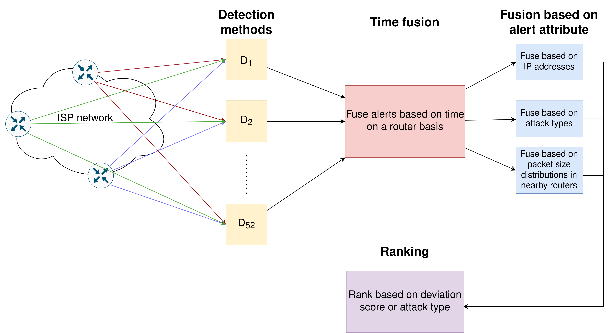

# Alert Fusion: A Combined Approach for DDoS Attack Detection
This IDS is developed as a part of a master's thesis written about DDoS detection.

## Architecture
An overview of the IDS architecture can be seen below.


## Summary
Distributed Denial of Service (DDoS) attacks are evolving in size and sophistication as technology progresses, posing significant threats to both Internet access customers and providers. Internet Service Providers (ISPs)
can employ Intrusion Detection Systems (IDSs) to detect such attacks. However, as attacks become more sophisticated, IDSs must also evolve accordingly. One potential approach to enhance IDS capabilities is through collaborative methods. This thesis explores the effectiveness of utilizing different anomaly detection methods and combining them in an IDS. The exploration follows a design process based on the design science research method.

An IDS is implemented with 52 methods and an alert fusion component to investigate the impact of various detection methods and their combination. These methods utilize NetFlow records or router interface telemetry measurements to detect 11 different types of DDoS attacks. Evaluation of method effectiveness relies on ground truth data from three rounds of generated attacks within a real ISP network. While specific methods demonstrate promise in detecting DDoS attacks within specific environments, most methods do not exhibit clear effectiveness.

Through the combination of individual detection method outputs, the alert fusion component of the IDS successfully detects 10 out of the 11 possible attacks. Additionally, the combined alerts are summarized and ranked based on their perceived level of danger. The effectiveness of the alert fusion approach varies depending on the user's definition of dangerous events and their criteria for a precise combination of alerts. Fusion methods based on time, attack type, IP address, or packet size distribution are employed. Time-based fusion yields the poorest results among these fusion approaches, with only a slight improvement in precision compared to the incoming alerts, dependent on different parameters. In contrast, fusion based on packet size distribution exhibits a high alert reduction and improved precision.

In conclusion, this thesis reveals that the efficacy of various anomaly detection methods in detecting DDoS attacks is heavily influenced by multiple factors, limiting the ability to generalize about their performance. Combining these methods can yield additional benefits, depending, however, upon parameters chosen during the implementation of the individual detection methods and the user's definition of benefits.

## Installation
All required packages are listed in requirements.txt.
Use the package manager [pip](https://pip.pypa.io/en/stable/) to install them.
```bash
pip install -r requirements.txt
```

## Usage
The whole IDS is run offline by reading calculations from files and communicating the alerts to the fusion unit via [MQTT](https://www.eclipse.org/paho/).
This is started by the command:
```bash
start.sh
```

## Plots
Various plots illustrating the performance of the IDS can be found in the folder Plots.